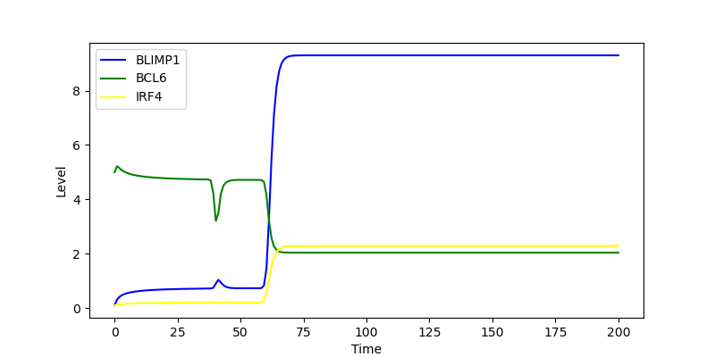

# Kinetic Model of Terminal B Cell Differentiation: Parameter Estimation and Bistability Analysis
Terminal differentiation of B cells into antibody-secreting plasma cells is governed by a tightly regulated transcriptional network involving BLIMP1, BCL6, and IRF4. The main interest of this study revolved around a kinetic model of B cell differentiation, originally developed by \cite{Martinez2012}. The model was numerically solved, and parameter fitting was performed. The aim was to reproduce the results and investigate the effects of parameter fitting under different constraints. Using gene expression data, parameter estimation was performed with and without enforcing bistability conditions. Enforcing bistability constraints improved biological plausibility by producing more switch-like behavior between the Germinal Center state and the Plasma Cell state. The study also discovered that some parameters are more sensitive than others to the width of the search bounds. While the model recapitulates key dynamics, the work highlighted a major shortcoming: the parameter estimation did not reproduce the same results as the original study.

